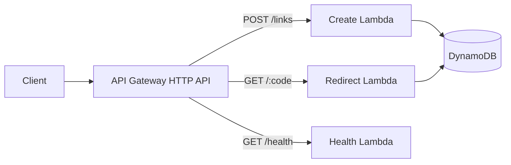

<div align="center">


**A serverless URL shortener built to explore collisions, expiration, IAM boundaries, failure modes, and scaling decisions—not just the happy path.**

[](https://github.com/yourclouddude)
[](https://yourclouddude.com/)

</div>

---

## Why this project exists

A URL shortener looks simple until you ask the questions that production systems eventually force you to answer:

- What if two requests generate the same short code?
- What if DynamoDB TTL has not removed an expired item yet?
- What permissions does each Lambda actually need?
- What becomes the bottleneck when traffic grows?
- What would need to change before anonymous public use?

The API stays intentionally small so those engineering decisions remain visible.

## Architecture



<div align="center">

`Client → API Gateway → Lambda → DynamoDB`

</div>

| Layer | Responsibility |
|---|---|
| API Gateway | HTTP boundary and routing |
| Lambda | Link creation, redirect resolution, health checks |
| DynamoDB | Short-code lookup and expiration metadata |
| AWS SAM | Infrastructure, permissions, runtime configuration |
| GitHub Actions | Linting, tests, validation, build checks |

## Key engineering decisions

### Collision-safe writes

Random short-code generation lowers collision probability; it does not make collisions impossible. Creation uses a DynamoDB conditional expression so an existing link is never silently overwritten.

```text
generate code → conditional write → retry on collision
```

### Application-level expiration

DynamoDB TTL cleanup is asynchronous. The redirect Lambda therefore checks `expires_at` itself instead of assuming an item is valid simply because it still exists.

### Narrow IAM boundaries

The create and redirect paths do not receive identical permissions. The create path writes records, while the redirect path reads them. Credentials are never stored in source code.

### Simple data model

```json
{
  "short_code": "aB3xQ7zK",
  "destination_url": "https://example.com/learn-aws",
  "created_at": 1770000000,
  "expires_at": 1780000000
}
```

One short code maps to one destination. The access pattern is intentionally straightforward, which is exactly why DynamoDB is a reasonable fit.

## Run locally

### Requirements

- Python 3.13+
- AWS CLI
- AWS SAM CLI

```bash
python -m venv .venv
pip install -r requirements-dev.txt
python -m ruff check src tests
python -m pytest -q
sam validate --lint
sam build
```

GitHub Actions runs the same quality gates on repository changes.

## Deploy

```bash
sam deploy --guided
```

Use credentials from the normal AWS credential chain, AWS SSO, or another supported provider. Never place long-lived AWS credentials in this repository.

After deployment, CloudFormation outputs the API endpoint.

### Health check

```bash
curl https://YOUR_API_ID.execute-api.YOUR_REGION.amazonaws.com/health
```

### Create a short link

```bash
curl -X POST \
  -H "content-type: application/json" \
  -d '{"url":"https://example.com/learn-aws","expires_in_days":7}' \
  https://YOUR_API_ID.execute-api.YOUR_REGION.amazonaws.com/links
```

Example response:

```json
{
  "code": "aB3xQ7zK",
  "path": "/aB3xQ7zK",
  "expires_at": 1780000000
}
```

Follow the redirect:

```bash
curl -i https://YOUR_API_ID.execute-api.YOUR_REGION.amazonaws.com/aB3xQ7zK
```

A valid link returns `302` with the destination in the `Location` header.

## Security boundaries

The learning version starts with sane defaults instead of treating security as a later decoration:

- only `http` and `https` destinations are accepted
- input length is capped
- conditional writes prevent collision overwrites
- create and redirect Lambdas receive different DynamoDB permissions
- credentials stay outside source control

This is **not** presented as a hardened anonymous public URL-shortening service.

## What breaks first on the public internet?

Usually abuse—not DynamoDB scale.

Before exposing link creation publicly, consider authentication, quotas, malicious-destination controls, throttling, abuse detection, alarms, dashboards, WAF where appropriate, a custom domain, and asynchronous analytics.

## Scaling questions worth exploring

At low traffic, API Gateway + Lambda + DynamoDB keeps operations simple. As traffic grows, the interesting questions become Lambda concurrency, DynamoDB throttling, API latency, hot keys, abuse, observability cost, and cache behavior.

Popular redirects could benefit from edge caching, but caching introduces expiration and invalidation trade-offs. A multi-Region design would add decisions around routing, replication, consistency, and recovery.

## Experiments to try next

1. Add custom aliases and define alias-collision behavior.
2. Publish redirect events to SQS or EventBridge for asynchronous analytics.
3. Add API throttling and inspect behavior under repeated requests.
4. Put CloudFront in front of redirects and study cache-expiration trade-offs.
5. Rebuild the infrastructure in Terraform and compare the workflow with SAM.

## Questions you should be able to answer

- Why is DynamoDB a good fit for this access pattern?
- Why use a conditional write if the code is random?
- Why check `expires_at` when TTL is enabled?
- Which permissions belong to each Lambda?
- Where should click analytics live without slowing redirects?
- What needs to change before anonymous link creation?
- When would caching help, and what consistency problem would it introduce?

## Repository map

```text
.
├── .github/workflows/ci.yml
├── docs/
│   ├── architecture.md
│   └── troubleshooting.md
├── src/
│   ├── common.py
│   ├── create_link.py
│   ├── health.py
│   └── redirect.py
├── tests/
│   └── test_handlers.py
├── pyproject.toml
├── requirements-dev.txt
└── template.yaml
```

For common SAM, IAM, DynamoDB, and local-test issues, see [`docs/troubleshooting.md`](docs/troubleshooting.md).

## Cost & cleanup

Serverless does not mean free. Depending on usage and Region, charges can come from API Gateway, Lambda, DynamoDB, CloudWatch, storage, and data transfer.

```bash
sam delete
```

Review current AWS pricing before leaving a learning deployment running.

---

<div align="center">

### YourCloudDude

**Build it. Understand the decisions. Explain why it works.**

[](https://yourclouddude.com/)


</div>