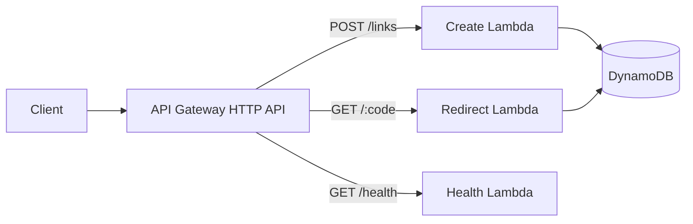

<div align="center">

# 🔗 AWS Serverless URL Shortener

**A learner-first AWS project about collisions, expiration, IAM, and failure — not just shortening links.**

`API Gateway` · `Lambda` · `DynamoDB` · `AWS SAM` · `Python`

[Architecture](#-architecture) · [Run locally](#-run-it-locally) · [Deploy](#-deploy) · [Security](#-security-boundaries) · [Experiments](#-experiments-to-try)

</div>

---

> **The engineering question:** What does a URL shortener look like when random-code collisions, asynchronous TTL cleanup, least-privilege IAM, and public-service abuse are treated as real design constraints?

## ✨ What makes this project worth studying

The API is intentionally small. The useful part is the reasoning around it.

| Concern | Design choice |
|---|---|
| Short-code collision | DynamoDB conditional write + retry |
| Expired links | Application checks `expires_at`; TTL is cleanup, not correctness |
| Permissions | Create and redirect Lambdas get different DynamoDB access |
| Infrastructure | AWS SAM keeps routes, runtime, table, and IAM reviewable |
| Public exposure | README explicitly separates the learning deployment from a hardened public service |

## 🏗️ Architecture



```text
Client → API Gateway → Lambda → DynamoDB
```

API Gateway owns the HTTP boundary, Lambda keeps compute event-driven, and DynamoDB fits the main access pattern: given one short code, retrieve one record.

### The important part is between the boxes

**Creation**

```text
generate code → conditional write → retry on collision
```

The create function validates the destination, generates a cryptographically random code, and writes with a DynamoDB condition. Random generation makes collisions unlikely; the conditional write makes an accidental collision safe.

**Resolution**

A `GET /{code}` request reads the item and returns `302` only when the link is valid. DynamoDB TTL is enabled on `expires_at`, but TTL cleanup is asynchronous, so the redirect function checks expiration itself.

> **Key lesson:** TTL removes old data eventually. It should not be used as the application's definition of whether a link is currently valid.

## 🧱 Data model

```json
{
  "short_code": "aB3xQ7zK",
  "destination_url": "https://example.com/learn-aws",
  "created_at": 1770000000,
  "expires_at": 1780000000
}
```

The short code is the partition key. The access pattern is deliberately simple, which is exactly why DynamoDB is a reasonable fit.

## 🧪 Run it locally

**Prerequisites:** Python 3.13+, AWS CLI, and AWS SAM CLI.

```bash
python -m venv .venv
pip install -r requirements-dev.txt
python -m ruff check src tests
python -m pytest -q
sam validate --lint
sam build
```

GitHub Actions runs the repository quality gates on changes.

## 🚀 Deploy

```bash
sam deploy --guided
```

Use the normal AWS credential chain, AWS SSO, or another supported provider. **Never place long-lived AWS credentials in this repository.**

After deployment, CloudFormation outputs the API endpoint.

### Health

```bash
curl https://YOUR_API_ID.execute-api.YOUR_REGION.amazonaws.com/health
```

### Create a link

```bash
curl -X POST \
  -H "content-type: application/json" \
  -d '{"url":"https://example.com/learn-aws","expires_in_days":7}' \
  https://YOUR_API_ID.execute-api.YOUR_REGION.amazonaws.com/links
```

Example response:

```json
{
  "code": "aB3xQ7zK",
  "path": "/aB3xQ7zK",
  "expires_at": 1780000000
}
```

Follow it with:

```bash
curl -i https://YOUR_API_ID.execute-api.YOUR_REGION.amazonaws.com/aB3xQ7zK
```

A valid link returns `302` with the destination in the `Location` header.

## 🔐 Security boundaries

The create and redirect functions do not need identical DynamoDB permissions, so they do not receive identical access.

- create can write link records
- redirect reads records
- only `http` and `https` destinations are accepted
- input length is capped
- conditional writes prevent collision overwrites
- credentials are not stored in source code

This is a sane learning baseline, **not a claim that the repository is a hardened public URL-shortening platform**.

### What would break first on the public internet?

Probably abuse, not DynamoDB scale. Anonymous creation would require decisions around authentication, quotas, malicious destinations, bot traffic, and observability.

Before broader exposure, evaluate API throttling, authentication/API keys, domain validation, abuse detection, CloudWatch alarms, and—where the threat model justifies it—AWS WAF.

## 📈 Scaling decisions worth noticing

At low traffic, API Gateway + Lambda + DynamoDB keeps operations simple. With growth, Lambda concurrency, DynamoDB throttling, hot keys, latency, abuse, and observability cost become more important.

Edge caching can reduce repeated reads for popular links, but it introduces cache-expiration and invalidation decisions. Multi-Region operation would add routing, replication, consistency, and recovery trade-offs. Those concerns are intentionally outside this version.

## 💸 Cost & cleanup

Potential charges include API Gateway requests, Lambda execution, DynamoDB requests/storage, CloudWatch, and data transfer depending on usage and Region.

```bash
sam delete
```

Review current AWS pricing before leaving a learning stack running.

## 🧠 Experiments to try

These extensions force a new engineering decision instead of simply adding another AWS service:

1. Add custom aliases such as `/aws-roadmap` and define collision behavior.
2. Publish redirect events to SQS or EventBridge so analytics stay off the redirect path.
3. Add throttling and inspect API Gateway behavior under repeated requests.
4. Put CloudFront in front of redirects and reason about cache expiration.
5. Rebuild the infrastructure in Terraform and compare the workflow with SAM.

<details>
<summary><strong>Questions to test your understanding</strong></summary>

- Why is DynamoDB a good fit for this access pattern?
- Why use a conditional write when the code is random?
- Why check `expires_at` when DynamoDB TTL is enabled?
- What permissions does each Lambda actually need?
- Where should click analytics live without slowing redirects?
- What would you add before anonymous link creation?
- When would caching help, and what consistency problem would it introduce?

</details>

## 🗂️ Repository map

```text
.
├── .github/workflows/ci.yml
├── docs/
│   ├── architecture.md
│   └── troubleshooting.md
├── src/
│   ├── common.py
│   ├── create_link.py
│   ├── health.py
│   └── redirect.py
├── tests/
│   └── test_handlers.py
├── pyproject.toml
├── requirements-dev.txt
└── template.yaml
```

For common SAM, IAM, DynamoDB, and local-test problems, see [`docs/troubleshooting.md`](docs/troubleshooting.md).

---

<div align="center">

### YourCloudDude

Practical AWS, cloud, and Python projects built to make the engineering decisions understandable.

**yourclouddude.com**

</div>
