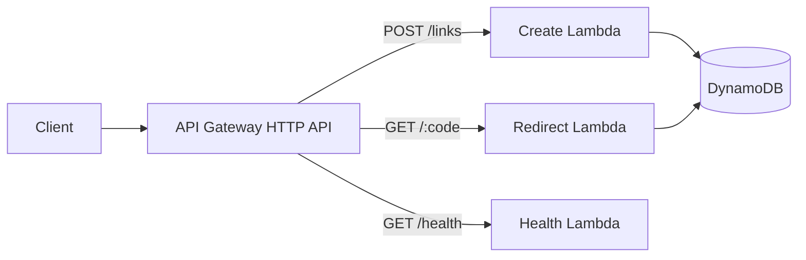

# AWS Serverless URL Shortener

A practical **YourCloudDude** project for learning how to build a small production-minded serverless API on AWS.

You will build a URL shortener with **Amazon API Gateway, AWS Lambda, Amazon DynamoDB, IAM, and AWS SAM** while learning the engineering decisions behind the architecture.

## What you will learn

- How an API Gateway HTTP API invokes Lambda functions
- How Lambda reads and writes DynamoDB data
- How to use DynamoDB conditional writes to avoid short-code collisions
- Why DynamoDB TTL should not be treated as an immediate delete mechanism
- How to keep IAM permissions scoped to the operations each function needs
- How to define and validate serverless infrastructure with AWS SAM
- How to test Lambda handlers without deploying to AWS
- How to reason about security, cost, reliability, and scaling

## Architecture



### Request flow

**Create a short link**

1. Client sends `POST /links` with a destination URL.
2. API Gateway invokes the create Lambda.
3. Lambda validates the URL and generates a random short code.
4. Lambda writes the record with a conditional expression so an existing code is never overwritten.
5. The API returns the generated short code and path.

**Resolve a short link**

1. Client requests `GET /{code}`.
2. API Gateway invokes the redirect Lambda.
3. Lambda reads the matching item from DynamoDB.
4. Lambda checks the application expiration timestamp.
5. The function returns an HTTP `302` redirect when the link is valid.

## Project structure

```text
.
├── .github/workflows/ci.yml
├── docs/
│   ├── architecture.md
│   └── troubleshooting.md
├── src/
│   ├── common.py
│   ├── create_link.py
│   ├── health.py
│   └── redirect.py
├── tests/
│   └── test_handlers.py
├── .gitignore
├── pyproject.toml
├── requirements-dev.txt
└── template.yaml
```

## Prerequisites

- Python 3.13+
- AWS CLI configured for an account you control
- AWS SAM CLI
- An AWS region where you are allowed to create Lambda, API Gateway, DynamoDB, CloudFormation, and IAM resources

> This repository never requires long-lived AWS credentials inside source code. Use the AWS CLI credential chain, an AWS SSO profile, or another supported credential provider.

## Run the tests locally

Create a virtual environment and install development dependencies:

```bash
python -m venv .venv
```

Activate it, then run:

```bash
pip install -r requirements-dev.txt
python -m ruff check src tests
python -m pytest -q
```

## Validate and build the SAM application

```bash
sam validate --lint
sam build
```

## Deploy to AWS

For a guided first deployment:

```bash
sam deploy --guided
```

SAM will ask for a stack name, AWS Region, and confirmation settings. Save the generated configuration only if it contains no secrets.

After deployment, CloudFormation outputs the API endpoint.

## API examples

### Health check

```bash
curl https://YOUR_API_ID.execute-api.YOUR_REGION.amazonaws.com/health
```

### Create a short link

```bash
curl -X POST \
  -H "content-type: application/json" \
  -d '{"url":"https://example.com/learn-aws","expires_in_days":7}' \
  https://YOUR_API_ID.execute-api.YOUR_REGION.amazonaws.com/links
```

Example response:

```json
{
  "code": "aB3xQ7zK",
  "path": "/aB3xQ7zK",
  "expires_at": 1780000000
}
```

### Follow the short link

```bash
curl -i https://YOUR_API_ID.execute-api.YOUR_REGION.amazonaws.com/aB3xQ7zK
```

A valid link returns `302` with the destination in the `Location` header.

## Data model

Each DynamoDB item uses the short code as the partition key:

```json
{
  "short_code": "aB3xQ7zK",
  "destination_url": "https://example.com/learn-aws",
  "created_at": 1770000000,
  "expires_at": 1780000000
}
```

DynamoDB TTL is configured on `expires_at`. The redirect Lambda still checks `expires_at` itself because TTL deletion is asynchronous; an expired item may remain in the table for some time.

## Security choices

- No AWS credentials are stored in the repository.
- Create and redirect Lambdas receive separate DynamoDB IAM permissions.
- Short-code writes use `attribute_not_exists(short_code)` so collisions cannot overwrite existing links.
- Only `http` and `https` destination URLs are accepted.
- Input length is capped to reduce accidental or abusive payloads.
- DynamoDB encryption at rest is enabled by AWS.

### Before using this as a public internet service

Add controls that are intentionally outside this learning version:

- authentication or API keys for link creation
- rate limiting and abuse detection
- domain/block-list validation
- AWS WAF where appropriate
- CloudWatch alarms and structured operational dashboards
- custom domain + TLS configuration
- analytics implemented asynchronously rather than on the redirect hot path

## Cost awareness

This architecture is intentionally serverless: API Gateway, Lambda, and DynamoDB on-demand capacity can stay inexpensive at learning or low traffic volumes, but they are not "free forever." Always review the AWS pricing pages for your Region and remove resources when you finish experimenting.

Delete the deployed stack with:

```bash
sam delete
```

## Scaling discussion

The basic architecture already removes server management, but a production design still needs engineering decisions as traffic grows.

**Low traffic:** API Gateway + Lambda + DynamoDB is simple and operationally light.

**Higher traffic:** monitor Lambda concurrency, DynamoDB throttling, API latency, hot keys, abuse, and CloudWatch cost. Redirect caching at the edge can reduce repeated reads for popular links.

**Large public service:** consider a custom domain, CloudFront, WAF, asynchronous click analytics, stronger abuse controls, multi-Region requirements, and an explicit disaster-recovery strategy.

## Extend the project

Try these in order:

1. Add custom aliases such as `/aws-roadmap`.
2. Add an authenticated admin endpoint to deactivate links.
3. Add API Gateway throttling and creation quotas.
4. Publish redirect events to EventBridge or SQS for asynchronous analytics.
5. Add CloudWatch alarms for errors and latency.
6. Put CloudFront in front of the redirect path and discuss caching trade-offs.
7. Add a custom domain with Route 53 and ACM.
8. Rebuild the infrastructure in Terraform and compare the developer experience.

## Interview questions to practice

1. Why use DynamoDB instead of a relational database here?
2. Why is a conditional write used when generating the short code?
3. Why does the Lambda check expiration when DynamoDB TTL exists?
4. What happens when Lambda scales to many concurrent executions?
5. How would you prevent abuse of the creation endpoint?
6. Where would you add analytics without slowing redirects?
7. What would CloudFront change in this architecture?
8. How would you design this for multiple AWS Regions?
9. What IAM permissions should each Lambda receive?
10. Which metrics and alarms would you create before production use?

## Troubleshooting

See [`docs/troubleshooting.md`](docs/troubleshooting.md) for common SAM, IAM, DynamoDB, and local test problems.

## About YourCloudDude

**YourCloudDude** creates practical AWS, cloud, and Python learning resources focused on learning by building.

Website: https://yourclouddude.com/

---

If this project helped you understand serverless architecture, fork it, extend it, and document the decisions you made. The goal is not only to make the code run — it is to understand **why the system is designed this way**.
