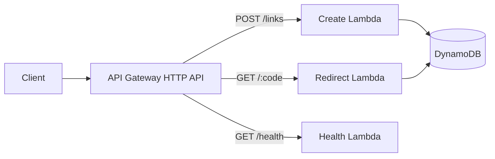

# AWS Serverless URL Shortener

A small AWS project built around one simple question: **what does a URL shortener look like when you stop treating it like a toy script and start thinking about collisions, expiration, IAM, and failure?**

The API itself is intentionally small. The interesting part is the engineering around it.

```text
Client → API Gateway → Lambda → DynamoDB
```

There are separate Lambda functions for creating links, resolving them, and checking health. AWS SAM defines the infrastructure so you can inspect the API routes, DynamoDB table, permissions, and runtime settings in one place.

## Why this architecture

A URL shortener does not need a complicated stack to be useful as an AWS project.

API Gateway handles the HTTP boundary, Lambda keeps the compute event-driven, and DynamoDB fits the access pattern well: given a short code, fetch one record quickly. That makes the project a good place to focus on the decisions that are easy to gloss over in beginner demos.



The important design choices are not the boxes in the diagram. They are what happens when two requests generate the same code, when an expired item still exists in DynamoDB, or when a function receives more permissions than it actually needs.

## Creating a short link

A client sends `POST /links` with a destination URL.

The create function validates the input, generates a cryptographically random short code, and writes the record with a DynamoDB conditional expression. The condition matters because random generation does not make collisions impossible. If a code already exists, the function retries instead of overwriting someone else's link.

That is the difference between:

```text
generate code → write item
```

and the safer version used here:

```text
generate code → conditional write → retry on collision
```

## Resolving a link

A request to `GET /{code}` reads the matching DynamoDB item and returns an HTTP `302` redirect when the link is valid.

DynamoDB TTL is enabled on `expires_at`, but the redirect function **still checks expiration itself**. TTL cleanup is asynchronous. An expired item can remain in the table for a while, so using "item still exists" as the definition of "link is valid" would be incorrect.

That small detail is one of the main reasons this project exists.

## The data model

Each item uses the short code as the partition key:

```json
{
  "short_code": "aB3xQ7zK",
  "destination_url": "https://example.com/learn-aws",
  "created_at": 1770000000,
  "expires_at": 1780000000
}
```

The access pattern is deliberately boring: one short code maps to one destination. There is no relational model to justify here, and that is exactly why DynamoDB is a reasonable fit.

## Run it locally first

You need Python 3.13+, the AWS CLI, and AWS SAM CLI for the full workflow.

Create a virtual environment:

```bash
python -m venv .venv
```

Activate it, then install the development dependencies and run the checks:

```bash
pip install -r requirements-dev.txt
python -m ruff check src tests
python -m pytest -q
sam validate --lint
sam build
```

GitHub Actions runs the same quality gates on repository changes.

## Deploy it

For a first deployment:

```bash
sam deploy --guided
```

SAM will ask for the stack name, AWS Region, and deployment settings. Use credentials from the normal AWS credential chain, AWS SSO, or another supported provider. Do not place long-lived credentials in the repository.

After deployment, CloudFormation outputs the API endpoint.

### Health check

```bash
curl https://YOUR_API_ID.execute-api.YOUR_REGION.amazonaws.com/health
```

### Create a link

```bash
curl -X POST \
  -H "content-type: application/json" \
  -d '{"url":"https://example.com/learn-aws","expires_in_days":7}' \
  https://YOUR_API_ID.execute-api.YOUR_REGION.amazonaws.com/links
```

Example response:

```json
{
  "code": "aB3xQ7zK",
  "path": "/aB3xQ7zK",
  "expires_at": 1780000000
}
```

Then follow it:

```bash
curl -i https://YOUR_API_ID.execute-api.YOUR_REGION.amazonaws.com/aB3xQ7zK
```

A valid link returns `302` with the destination in the `Location` header.

## Permissions are part of the project

The create and redirect functions do not need identical DynamoDB permissions, so the SAM template does not give them identical access.

The project keeps the boundary narrow:

- the create path can write link records
- the redirect path reads records
- credentials are not stored in source code
- only `http` and `https` destinations are accepted
- input length is capped
- conditional writes prevent collision overwrites

That does not make this a hardened public URL-shortening service. It means the learning version starts with sane boundaries instead of fixing obviously unsafe defaults later.

## What would break first on the public internet?

Abuse, not DynamoDB scale.

A public creation endpoint would need decisions around authentication, quotas, malicious destinations, bot traffic, and observability before "how many redirects can this handle?" becomes the most interesting question.

Before exposing this beyond a controlled learning deployment, consider:

- authentication or API keys for link creation
- API throttling and abuse detection
- domain or block-list validation
- AWS WAF where it actually fits the threat model
- CloudWatch alarms and operational dashboards
- a custom domain and TLS setup
- asynchronous analytics rather than adding work to the redirect path

The repository does not pretend those controls already exist.

## A few scaling decisions worth noticing

At low traffic, API Gateway + Lambda + DynamoDB keeps operations simple.

As traffic grows, the questions change: Lambda concurrency, DynamoDB throttling, API latency, hot keys, abuse, and observability cost start to matter. If a small set of links becomes extremely popular, edge caching can reduce repeated reads, but caching also changes expiration and invalidation behavior.

For a multi-Region service, the design would need another round of decisions around routing, replication, consistency, and failure recovery. Those are intentionally outside this version.

## Cost and cleanup

This project uses serverless services because they fit the workload, not because they are magically free. Charges can come from API Gateway requests, Lambda execution, DynamoDB requests/storage, CloudWatch, and data transfer depending on usage and Region.

When you are finished experimenting:

```bash
sam delete
```

Review current AWS pricing before deploying anything you plan to leave running.

## Try changing one thing at a time

Good next experiments are the ones that force a new engineering decision rather than simply adding another AWS icon.

For example:

1. add custom aliases such as `/aws-roadmap` and decide how to handle alias collisions
2. publish redirect events to SQS or EventBridge so analytics stay off the redirect path
3. add throttling and observe how API Gateway behavior changes under repeated requests
4. put CloudFront in front of redirects and work through cache-expiration trade-offs
5. rebuild the infrastructure in Terraform and compare the workflow with SAM

## Questions you should be able to answer after building it

- Why is DynamoDB a good fit for this access pattern?
- Why does the create function use a conditional write even though the code is random?
- Why check `expires_at` when DynamoDB TTL is already enabled?
- What permissions does each Lambda actually need?
- Where would you put click analytics without slowing down redirects?
- What would you add before allowing anonymous users to create links?
- When would caching help, and what new consistency problem would it introduce?

## Repository map

```text
.
├── .github/workflows/ci.yml
├── docs/
│   ├── architecture.md
│   └── troubleshooting.md
├── src/
│   ├── common.py
│   ├── create_link.py
│   ├── health.py
│   └── redirect.py
├── tests/
│   └── test_handlers.py
├── .gitignore
├── pyproject.toml
├── requirements-dev.txt
└── template.yaml
```

For common SAM, IAM, DynamoDB, and local-test problems, see [`docs/troubleshooting.md`](docs/troubleshooting.md).

## YourCloudDude

YourCloudDude builds practical AWS, cloud, and Python projects around one idea: **build it, understand the decisions, then explain why it works.**

Website: https://yourclouddude.com/
