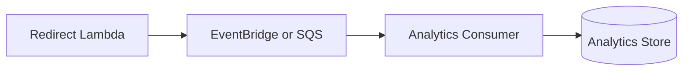

# Architecture Deep Dive

This document explains the decisions behind the YourCloudDude AWS Serverless URL Shortener.

## Components

| Component | Responsibility | Why it fits |
|---|---|---|
| API Gateway HTTP API | Public HTTP entry point | Managed routing and Lambda integration without running web servers |
| Create Lambda | Validate requests and persist short links | Compute runs only when a link is created |
| Redirect Lambda | Resolve codes and return redirects | Stateless request handling that can scale independently |
| Health Lambda | Lightweight service health endpoint | Keeps the teaching flow explicit and easy to test |
| DynamoDB | Store code-to-URL mappings | Key-value access pattern maps naturally to a partition-key lookup |
| AWS SAM | Define deployable infrastructure | Keeps application and infrastructure versioned together |

## Why DynamoDB?

The dominant read operation is:

```text
short_code -> destination_url
```

That is a direct key lookup, which is a strong fit for DynamoDB. This project does not need joins, complex relational queries, or multi-row transactions.

That does **not** mean DynamoDB is always the correct database for URL shorteners. A system that requires complex reporting, relational ownership models, or transactional workflows may justify a different data model.

## Collision handling

Random codes can collide, even if the probability is small. The create Lambda therefore writes with:

```text
attribute_not_exists(short_code)
```

DynamoDB performs the condition atomically. If another item already owns the code, the function generates another code and retries rather than overwriting the existing destination.

This is safer than checking for a code first and writing afterward because a separate read-then-write sequence introduces a race condition.

## Expiration and DynamoDB TTL

The table enables TTL on `expires_at`, but TTL deletion is asynchronous. The redirect Lambda therefore checks the timestamp before redirecting.

This gives the application deterministic expiration behavior even while DynamoDB is waiting to remove the expired row in the background.

## IAM boundaries

The functions intentionally receive different permissions:

- Create Lambda: `dynamodb:PutItem`
- Redirect Lambda: `dynamodb:GetItem`
- Health Lambda: no DynamoDB access

The goal is to teach least privilege: permissions should follow what a component actually needs to do.

## Why API Gateway HTTP API?

The project needs simple HTTP routing to Lambda and does not depend on advanced REST API-specific functionality. HTTP API keeps the learning architecture smaller while preserving the important API Gateway concepts.

## Why no click counter in the redirect Lambda?

A synchronous counter write would add work and latency to the redirect hot path. A more scalable learning extension is:



The redirect can publish an event and return quickly, while another component processes analytics asynchronously.

## Production gaps intentionally left for learners

This repository demonstrates the core system, not a complete internet-scale product. Before production use, evaluate:

- authentication and authorization for link creation
- rate limiting and quotas
- abusive or malicious destination URLs
- custom domains and certificates
- WAF rules
- observability and alert thresholds
- backups and disaster recovery
- multi-Region requirements
- redirect caching strategy
- compliance and data-retention requirements

## Scaling thought exercise

### 1,000 requests/day

The current architecture is usually operationally simple. Focus on correctness, logs, and cost hygiene.

### 100,000 requests/day

Measure p95/p99 latency, Lambda concurrency, DynamoDB consumption, API errors, and hot-link behavior. Add alarms and abuse controls before adding complexity.

### 1,000,000+ requests/day

Consider edge caching for popular redirects, asynchronous analytics, more deliberate observability, multi-Region requirements, and stronger operational controls. Scale decisions should come from measured traffic patterns rather than automatically adding services.
